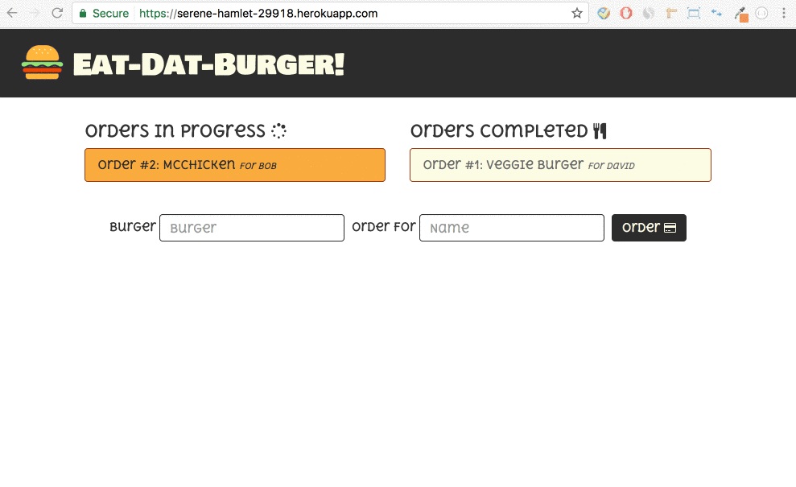

# Burger (Sequelize Version)

# Table of Contents 

1. [Overview](#overview)
2. [Installation](#installation)
3. [Initializing](#initializing)
	- [Local Server](#local-server)
	- [Heroku](#heroku)
4. [How It Works](#how-it-works)

<a name="overview"></a>
## Overview

Burger (Sequelize Version) is a burger logger with a MVC architecture. It utilizes MySQL to keep track of each burger order and other technologies such as Node, Express, Handlebars, and Sequelize to handle routing and generate the page.

<a name="installation"></a>
## Installation

### Step 1: Git Clone

Clone Sequelized-Burger to your local git repo like the following:

```
git clone https://github.com/caseykwok/Sequelized-Burger.git
```

The Sequelized-Burger project and its files should now be in your project folder.

### Step 2: Install Dependencies

Install all modules listed as dependencies in `package.json` like the following:

```
npm install
```

The dependencies should now be in the local `node_modules` folder.

<a name="initializing"></a>
## Initializing

There are two ways to run this application. The user can either run the application on their local server or access the application deployed to Heroku.

<a name="local-server"></a>
### Local Server

1. Ensure the two steps in [Installation](#installation) are completed.

2. Run the Node application called `server.js` to initialize the user's local server like the following:

	```
	node server.js
	```

3. Open the browser and connect to [port 3000 of the local host](http://localhost:3000/) to reach the homepage.

<a name="heroku"></a>
### Heroku

1. Open the browser and go to the [deployed Heroku application](https://powerful-savannah-67098.herokuapp.com/) to reach the homepage.

	- **Note:** It is unnecessary to complete the two steps in [Installation](#installation).

<a name="how-it-works"></a>
## How It Works

1. The homepage will display a list of all burger orders that have been completed along with the customer's name for each order. It will allow the user to do one of the following:

	- `Order` a burger 
	- `Complete` a burger order listed under *Orders In Progress*

2. If the user chooses to `Order` a burger, the application will add the burger to *Orders In Progress* after a burger name and a customer name for the order are provided by the user.

3. If the user chooses to `Complete` a burger order, the application will move the burger from *Orders In Progress* to *Orders Completed*.


